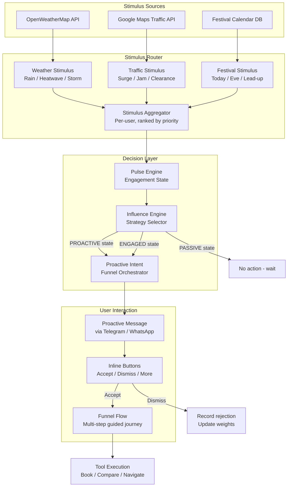
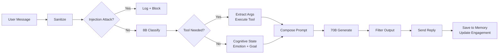
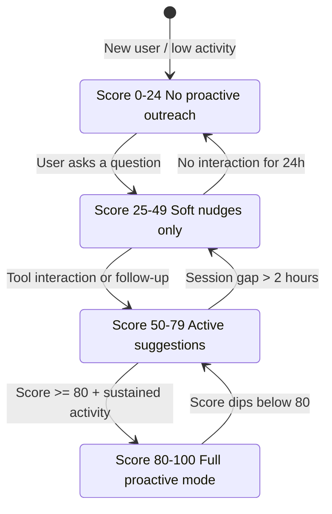

# Process Flow Diagram

## Stimulus-Driven Proactive Flow

The defining feature of Aria is the **stimulus loop** — a background process that continuously monitors environmental signals and proactively engages users when relevant.

## Conversational Message Flow

## Engagement State Machine

