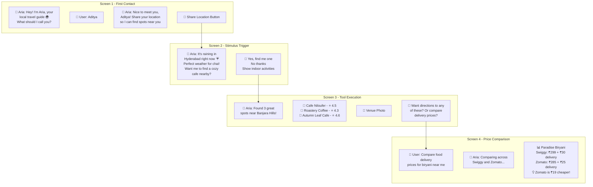
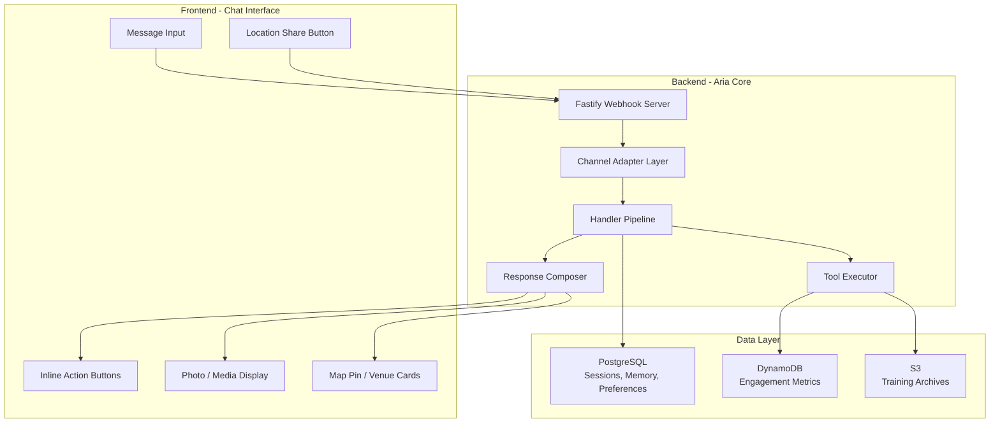

# Wireframe / Mock Diagram

## Conversational Interface Flow

Aria operates as a **chat-native agent** — no separate app or dashboard required. The wireframe below shows the Telegram interface flow.

## System Component Wireframe

