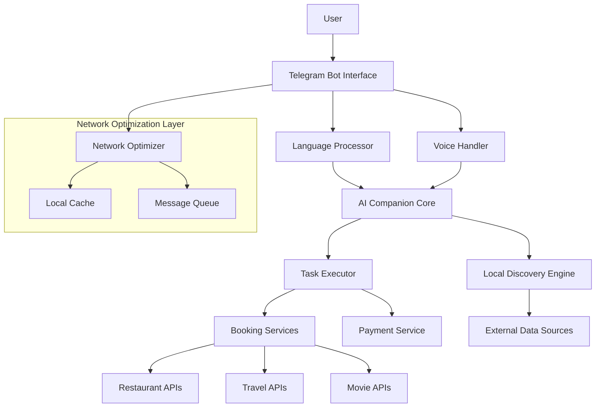

# Design Document: Personifi AI Companion Platform

## Overview

Personifi is a conversational AI platform that operates within Telegram to provide natural language interaction in Hindi and regional languages, with voice support and real-world task execution capabilities. The system is designed for users in smaller cities with limited smartphone experience and slower network connections.

The platform consists of several interconnected components: a Telegram bot interface, multilingual natural language processing, voice handling, local discovery engine, booking services integration, and network optimization layers. The architecture prioritizes simplicity, reliability, and accessibility while maintaining the ability to complete complex real-world tasks.

## Architecture

The system follows a microservices architecture with the following high-level components:



The architecture is designed to handle high latency and intermittent connectivity while providing a seamless user experience. Each component can operate independently and gracefully degrade when dependencies are unavailable.

## Components and Interfaces

### Telegram Bot Interface
The primary user interaction layer that handles all Telegram-specific functionality:

**Core Responsibilities:**
- Message routing and formatting
- Session management and user state
- Webhook handling for real-time updates
- Media processing (voice, images, documents)

**Key Interfaces:**
```
interface TelegramBotInterface {
    handleMessage(message: TelegramMessage): Promise<Response>
    sendResponse(chatId: string, response: BotResponse): Promise<void>
    processVoiceMessage(voiceFile: File): Promise<AudioData>
    maintainSession(userId: string): UserSession
}
```

### Language Processor
Handles multilingual natural language understanding and generation:

**Core Responsibilities:**
- Language detection and classification
- Intent extraction and entity recognition
- Context maintenance across conversations
- Response generation in user's preferred language

**Supported Languages:**
- Hindi (primary)
- Regional languages: Bengali, Tamil, Telugu, Marathi, Gujarati, Kannada, Malayalam, Punjabi, Odia
- Code-mixed conversations (Hindi-English, regional-English)

**Key Interfaces:**
```
interface LanguageProcessor {
    detectLanguage(text: string): Language
    extractIntent(text: string, context: ConversationContext): Intent
    generateResponse(intent: Intent, data: any, language: Language): string
    maintainContext(userId: string, message: string): ConversationContext
}
```

### Voice Handler
Manages speech-to-text and text-to-speech functionality:

**Core Responsibilities:**
- Audio format conversion and compression
- Speech recognition for Indian languages and accents
- Natural voice synthesis with regional pronunciation
- Audio quality optimization for low bandwidth

**Technical Implementation:**
- Primary ASR: Sarvam AI Saarika-5 for Indian languages
- Fallback ASR: Whisper API for broader language support
- TTS: Bhashini AI or AI4Bharat Indic-TTS for natural Indian voices
- Audio compression: Opus codec for efficient transmission

**Key Interfaces:**
```
interface VoiceHandler {
    speechToText(audioData: AudioData, language: Language): Promise<string>
    textToSpeech(text: string, language: Language, voice: VoiceProfile): Promise<AudioData>
    optimizeAudio(audio: AudioData, bandwidth: NetworkSpeed): AudioData
    detectSpeechLanguage(audioData: AudioData): Language
}
```

### AI Companion Core
The central orchestration layer that coordinates all system components:

**Core Responsibilities:**
- Conversation flow management
- Decision making and task routing
- User preference learning and personalization
- Error handling and fallback coordination

**Key Interfaces:**
```
interface AICompanionCore {
    processUserRequest(request: UserRequest): Promise<CompanionResponse>
    routeToTaskExecutor(intent: Intent, parameters: any): Promise<TaskResult>
    updateUserPreferences(userId: string, preferences: UserPreferences): void
    handleError(error: SystemError, context: ConversationContext): ErrorResponse
}
```

### Local Discovery Engine
Finds and recommends local experiences and services:

**Core Responsibilities:**
- Location-based service discovery
- Local business database management
- Recommendation filtering and ranking
- Real-time availability checking

**Data Sources:**
- Google Places API for comprehensive business listings
- Zomato API for restaurant data and reviews
- Local business directories and partnerships
- User-generated content and reviews

**Key Interfaces:**
```
interface LocalDiscoveryEngine {
    findNearbyServices(location: Location, category: ServiceCategory): Promise<Service[]>
    getServiceDetails(serviceId: string): Promise<ServiceDetails>
    filterByPreferences(services: Service[], preferences: UserPreferences): Service[]
    checkAvailability(serviceId: string, datetime: DateTime): Promise<AvailabilityStatus>
}
```

### Task Executor
Handles real-world task completion and booking processes:

**Core Responsibilities:**
- Booking workflow orchestration
- Payment processing coordination
- Confirmation and receipt management
- Error handling and retry logic

**Key Interfaces:**
```
interface TaskExecutor {
    executeBooking(bookingRequest: BookingRequest): Promise<BookingResult>
    processPayment(paymentDetails: PaymentDetails): Promise<PaymentResult>
    sendConfirmation(booking: CompletedBooking): Promise<void>
    handleBookingFailure(error: BookingError): Promise<AlternativeOptions>
}
```

### Booking Services Integration
Connects with external booking platforms and APIs:

**Supported Services:**
- **Restaurants:** Zomato, Swiggy, local restaurant systems
- **Travel:** IRCTC, RedBus, MakeMyTrip, Goibibo APIs
- **Movies:** BookMyShow, PVR, local cinema chains
- **Local Services:** UrbanClap, Justdial, local service providers

**Key Interfaces:**
```
interface BookingServices {
    searchAvailability(service: ServiceType, criteria: SearchCriteria): Promise<AvailableOptions>
    createBooking(option: BookingOption, userDetails: UserDetails): Promise<BookingConfirmation>
    cancelBooking(bookingId: string): Promise<CancellationResult>
    getBookingStatus(bookingId: string): Promise<BookingStatus>
}
```

### Network Optimizer
Ensures reliable operation on slow and intermittent connections:

**Core Responsibilities:**
- Data compression and caching
- Request queuing and retry logic
- Bandwidth adaptation
- Offline capability management

**Key Interfaces:**
```
interface NetworkOptimizer {
    compressData(data: any): CompressedData
    cacheResponse(key: string, data: any, ttl: number): void
    queueRequest(request: NetworkRequest): Promise<Response>
    adaptToBandwidth(content: Content, bandwidth: NetworkSpeed): OptimizedContent
}
```

## Data Models

### User Profile
```typescript
interface UserProfile {
    userId: string
    telegramId: string
    preferredLanguage: Language
    location: Location
    preferences: UserPreferences
    conversationHistory: ConversationEntry[]
    bookingHistory: BookingRecord[]
    createdAt: DateTime
    lastActive: DateTime
}

interface UserPreferences {
    cuisineTypes: string[]
    priceRange: PriceRange
    travelPreferences: TravelPreferences
    communicationStyle: CommunicationStyle
    accessibilityNeeds: AccessibilityOptions
}
```

### Conversation Context
```typescript
interface ConversationContext {
    userId: string
    sessionId: string
    currentIntent: Intent
    entities: ExtractedEntity[]
    conversationState: ConversationState
    language: Language
    messageHistory: Message[]
    pendingTasks: PendingTask[]
}

interface Message {
    messageId: string
    content: string
    messageType: MessageType // text, voice, image
    timestamp: DateTime
    language: Language
    intent: Intent
    entities: ExtractedEntity[]
}
```

### Service and Booking Models
```typescript
interface Service {
    serviceId: string
    name: string
    category: ServiceCategory
    location: Location
    description: string
    rating: number
    priceRange: PriceRange
    availability: AvailabilitySchedule
    contactInfo: ContactInfo
    bookingMethods: BookingMethod[]
}

interface BookingRequest {
    serviceId: string
    userId: string
    requestedDateTime: DateTime
    partySize: number
    specialRequests: string[]
    paymentMethod: PaymentMethod
    contactPreferences: ContactPreferences
}

interface BookingResult {
    bookingId: string
    status: BookingStatus
    confirmationDetails: ConfirmationDetails
    paymentStatus: PaymentStatus
    cancellationPolicy: CancellationPolicy
    supportContact: ContactInfo
}
```

### Voice and Audio Models
```typescript
interface AudioData {
    audioId: string
    format: AudioFormat
    duration: number
    sampleRate: number
    channels: number
    data: Buffer
    language?: Language
    transcription?: string
}

interface VoiceProfile {
    voiceId: string
    language: Language
    gender: Gender
    accent: RegionalAccent
    speed: SpeechSpeed
    pitch: number
}
```

## Correctness Properties

*A property is a characteristic or behavior that should hold true across all valid executions of a system—essentially, a formal statement about what the system should do. Properties serve as the bridge between human-readable specifications and machine-verifiable correctness guarantees.*

Based on the prework analysis, the following properties validate the system's correctness:

### Language Processing Properties

**Property 1: Hindi Intent Recognition**
*For any* Hindi message with a recognizable intent, the Language_Processor should correctly extract the intent and generate an appropriate response in Hindi
**Validates: Requirements 1.1**

**Property 2: Regional Language Processing**
*For any* message in a supported regional language, the Language_Processor should process the request and maintain conversational context
**Validates: Requirements 1.2**

**Property 3: Language Consistency**
*For any* user input in a specific language, all system responses should be in the same language as the input
**Validates: Requirements 1.3, 2.2**

**Property 4: Language Detection Fallback**
*For any* ambiguous text input where language detection is uncertain, the system should ask for clarification in the most likely detected language
**Validates: Requirements 1.4**

### Voice Processing Properties

**Property 5: Speech Recognition Accuracy**
*For any* clear voice message in a supported language, the Voice_Handler should convert speech to text with acceptable accuracy thresholds
**Validates: Requirements 2.1**

**Property 6: Multilingual Speech Support**
*For any* voice input in Hindi or supported regional languages, the Voice_Handler should successfully process the speech recognition
**Validates: Requirements 2.4**

### Conversation Management Properties

**Property 7: Context Preservation**
*For any* conversation sequence, the AI_Companion should maintain context across multiple message exchanges and understand references to previous interactions
**Validates: Requirements 1.5, 9.1, 9.2**

**Property 8: Preference Persistence**
*For any* user preferences specified during conversations, the AI_Companion should remember and consistently apply them to future recommendations
**Validates: Requirements 9.3**

**Property 9: Interaction History Storage**
*For any* user interaction, the system should store the interaction data for improved personalization
**Validates: Requirements 9.4**

### Telegram Integration Properties

**Property 10: Message Type Handling**
*For any* message type (text, voice, images) sent through Telegram, the Telegram_Bot should successfully process and handle the message
**Validates: Requirements 3.2**

**Property 11: Message Formatting Consistency**
*For any* response sent through Telegram, the Telegram_Bot should format messages appropriately for Telegram's interface
**Validates: Requirements 3.3**

**Property 12: Session State Maintenance**
*For any* user session, the Telegram_Bot should maintain session state across conversation interruptions and resumptions
**Validates: Requirements 3.4**

**Property 13: Command Processing Flexibility**
*For any* user input, the Telegram_Bot should process both natural language requests and structured commands appropriately
**Validates: Requirements 3.5**

**Property 14: Interface Formatting Standards**
*For any* option presentation, the Telegram_Bot should use numbered lists and consistent formatting
**Validates: Requirements 7.2**

### Local Discovery Properties

**Property 15: Location-Based Recommendations**
*For any* user request for local recommendations, the Local_Discovery_Engine should provide options that are geographically relevant to the user's location
**Validates: Requirements 4.1**

**Property 16: Recommendation Data Completeness**
*For any* local service recommendation, the system should include essential details like ratings, prices, and availability information
**Validates: Requirements 4.2, 8.1, 8.2, 8.3**

**Property 17: Empty Results Handling**
*For any* search query that returns no local options, the Local_Discovery_Engine should suggest alternatives or nearby areas
**Validates: Requirements 4.3**

**Property 18: Local Business Prioritization**
*For any* set of search results, the Local_Discovery_Engine should rank locally-owned businesses higher than chain establishments
**Validates: Requirements 4.4**

**Property 19: Preference-Based Filtering**
*For any* user preferences specified, the Local_Discovery_Engine should filter recommendations to match those preferences
**Validates: Requirements 4.5**

### Task Execution Properties

**Property 20: Booking Completion Workflow**
*For any* valid booking request (restaurant, travel, or movie), the Task_Executor should complete the entire booking process including payment and confirmation
**Validates: Requirements 5.1, 5.2, 5.3**

**Property 21: Booking Confirmation Delivery**
*For any* successful booking, the Task_Executor should provide confirmation details and booking references to the user
**Validates: Requirements 5.5**

**Property 22: Secure Payment Processing**
*For any* payment transaction, the Task_Executor should handle payment processing securely and correctly
**Validates: Requirements 5.6**

**Property 23: Booking Service Authentication**
*For any* interaction with partner booking services, the Booking_Service should handle authentication and API communication properly
**Validates: Requirements 8.4**

**Property 24: Booking Confirmation Storage**
*For any* booking confirmation received from partner services, the Booking_Service should store and relay the confirmation details to users
**Validates: Requirements 8.5**

### Network Optimization Properties

**Property 25: Adaptive Network Compression**
*For any* data transmission under poor network conditions, the Network_Optimizer should apply appropriate compression techniques
**Validates: Requirements 6.1, 6.2, 6.3**

**Property 26: Caching Behavior**
*For any* frequently accessed data, the Network_Optimizer should cache the data locally for improved performance
**Validates: Requirements 6.4**

**Property 27: Offline Message Queuing**
*For any* message sent during connection loss, the Network_Optimizer should queue the message for delivery when connection is restored
**Validates: Requirements 6.5**

### Error Handling Properties

**Property 28: Comprehensive Error Recovery**
*For any* system error (language processing failure, voice recognition failure, network issues), the system should provide appropriate fallback options and inform users in their preferred language
**Validates: Requirements 2.3, 10.1, 10.3, 10.4, 10.5**

**Property 29: Booking Failure Handling**
*For any* failed booking attempt, the Task_Executor should inform the user of the failure and suggest alternative providers or times
**Validates: Requirements 5.4, 10.2**

**Property 30: User Guidance Provision**
*For any* user interaction indicating confusion or need for help, the system should provide helpful prompts, suggestions, and step-by-step guidance
**Validates: Requirements 7.4, 7.5**

**Property 31: Localized Error Messages**
*For any* error condition, the system should provide error explanations in the user's preferred language
**Validates: Requirements 7.3**

<function_calls>
<invoke name="prework">
<parameter name="featureName">personifi-ai-companion

## Error Handling

The system implements comprehensive error handling across all components to ensure graceful degradation and user-friendly error recovery:

### Language Processing Errors
- **Intent Recognition Failures**: When the system cannot understand user intent, it asks for clarification using simpler language in the detected language
- **Language Detection Uncertainty**: For ambiguous inputs, the system requests clarification in the most probable language
- **Context Loss**: If conversation context is lost, the system politely asks users to restate their request

### Voice Processing Errors
- **Speech Recognition Failures**: When voice-to-text conversion fails, the system offers text input as an alternative
- **Audio Quality Issues**: Poor audio quality triggers requests for clearer audio or text alternatives
- **Unsupported Language**: If voice input is in an unsupported language, the system explains limitations and suggests alternatives

### Network and Connectivity Errors
- **Connection Loss**: Messages are queued locally and sent when connectivity is restored
- **Slow Network**: Content is compressed and essential information is prioritized
- **API Timeouts**: Automatic retry logic with exponential backoff for external service calls
- **Bandwidth Limitations**: Adaptive content delivery based on detected network speed

### Booking and Task Execution Errors
- **Service Unavailability**: When booking services are down, alternative providers or times are suggested
- **Payment Failures**: Clear error messages with retry options and alternative payment methods
- **Booking Conflicts**: Real-time availability checking prevents double bookings
- **Authentication Issues**: Automatic token refresh and re-authentication for partner services

### User Experience Errors
- **Confusion Detection**: When users seem confused, step-by-step guidance is provided
- **Invalid Inputs**: Clear explanations of what went wrong and how to correct it
- **Feature Limitations**: Transparent communication about what the system can and cannot do

## Testing Strategy

The testing approach combines unit testing for specific scenarios with property-based testing for comprehensive coverage across all possible inputs.

### Unit Testing Approach
Unit tests focus on specific examples, edge cases, and integration points:

- **Language Processing**: Test specific Hindi phrases, regional language samples, and code-mixed conversations
- **Voice Recognition**: Test with sample audio files in different languages and quality levels
- **Booking Workflows**: Test complete booking flows with mock external services
- **Error Scenarios**: Test specific error conditions and recovery mechanisms
- **Integration Points**: Test component interactions and data flow between services

### Property-Based Testing Configuration
Property-based tests validate universal properties across randomized inputs:

- **Testing Framework**: Use Hypothesis (Python) or fast-check (TypeScript) for property-based testing
- **Test Iterations**: Minimum 100 iterations per property test to ensure comprehensive coverage
- **Input Generation**: Custom generators for Indian names, addresses, phone numbers, and language-specific text
- **Shrinking**: Automatic test case minimization when failures are found

### Property Test Implementation
Each correctness property must be implemented as a property-based test with the following tag format:

**Feature: personifi-ai-companion, Property {number}: {property_text}**

Example property test structure:
```python
@given(hindi_message_with_intent())
def test_hindi_intent_recognition(message_data):
    """Feature: personifi-ai-companion, Property 1: Hindi Intent Recognition"""
    intent = language_processor.extract_intent(message_data.text)
    response = ai_companion.generate_response(intent, message_data.language)
    
    assert intent.type == message_data.expected_intent
    assert response.language == Language.HINDI
    assert response.content is not None
```

### Test Data and Generators
- **Multilingual Text Generators**: Create realistic Hindi and regional language text with various intents
- **Voice Sample Generators**: Generate audio samples with different accents, speeds, and quality levels
- **Location Generators**: Create realistic Indian addresses and coordinates for location-based testing
- **Booking Scenario Generators**: Generate realistic booking requests with various parameters
- **Network Condition Simulators**: Test behavior under different bandwidth and connectivity conditions

### Integration Testing
- **End-to-End Workflows**: Test complete user journeys from initial contact to booking completion
- **External Service Mocking**: Mock all external APIs for reliable testing
- **Performance Testing**: Validate response times under various load conditions
- **Accessibility Testing**: Ensure voice features work for users with different abilities

### Continuous Testing
- **Automated Test Execution**: Run all tests on every code change
- **Property Test Monitoring**: Track property test coverage and failure patterns
- **Performance Regression Testing**: Monitor response times and resource usage
- **User Acceptance Testing**: Regular testing with actual users in target demographics